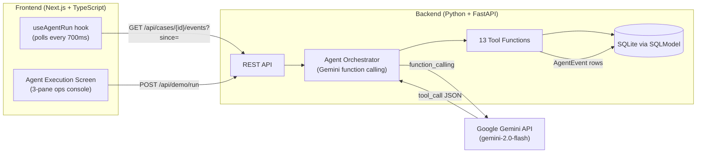

# ResolveAI

**Autonomous customer resolution agent — Tech Zephyr 4.0 Agentic AI Hackathon**

ResolveAI is not a support chatbot. It is a goal-driven agent that **investigates** a customer issue by calling real backend tools, **decides** a resolution path based on actual data, **executes** state-changing actions, **detects real failures**, **replans**, and **verifies** the outcome before declaring success.

---

## Why this is agentic, not a chatbot

| Chatbot | ResolveAI |
|---------|-----------|
| Answers questions | Resolves problems autonomously |
| Scripted responses | Dynamic tool selection per case |
| No state changes | Real DB mutations (inventory, orders, replacements) |
| No failure handling | Detects conflicts, replans, retries |
| No verification | Calls `verify_resolution` before declaring done |

The rubric vocabulary, mapped explicitly:

- **Goal-driven execution**: receives `"My order arrived damaged. I want a replacement."` as a goal; decides the entire resolution sequence autonomously.
- **Dynamic tool selection**: LLM chooses which of 13 tools to call each turn; never follows a hardcoded script.
- **Adaptation**: when `create_replacement(Mumbai)` returns `INVENTORY_UNAVAILABLE`, the agent calls `search_inventory`, finds Pune, and routes there — no UI branch, no scripted fallback.
- **Replanning**: the agent updates its internal state, selects a new warehouse, and executes a new tool chain.
- **Verification**: `verify_resolution` independently re-checks the DB (replacement record, order status, inventory decremented) before marking `case.status = resolved`.

---

## Architecture



---

## The Agent Loop

```
1. User creates a case (customer + order + message)
2. POST /api/cases/{id}/resolve starts background task
3. Agent sends initial message to Gemini with tool schemas
4. Gemini returns a function_call (e.g. get_customer)
5. Agent dispatches to the real tool function
6. Tool executes against DB, writes AgentEvent, returns structured JSON
7. Agent sends tool result back to Gemini
8. Repeat until Gemini stops calling tools or calls verify_resolution
9. verify_resolution independently checks DB consistency
10. If verified: case.status = resolved; execution ends
11. If not: agent escalates
```

**The conflict mechanic** (step 6 for `create_replacement`):
When `case.demo_conflict_pending = True`, the first call to `create_replacement("Mumbai")` decrements Mumbai's quantity inside its own DB transaction before checking availability — simulating a concurrent reservation. The function genuinely re-reads `quantity - reserved_quantity`, finds 0, and returns `INVENTORY_UNAVAILABLE`. The agent observes this real failure and calls `search_inventory` → finds Pune → retries there.

---

## Tool List

| Tool | What it does |
|------|-------------|
| `get_customer` | Retrieve customer record |
| `get_order` | Retrieve order record |
| `get_product` | Retrieve product details |
| `get_inventory` | Check stock at a specific warehouse |
| `search_inventory` | Find all warehouses with available stock |
| `get_policy` | Retrieve resolution policy for issue type |
| `check_resolution_eligibility` | Programmatically evaluate policy rules |
| `reserve_inventory` | Reserve 1 unit at a warehouse |
| `create_replacement` | Create replacement record; handles conflict |
| `cancel_reservation` | Cancel a previously reserved unit |
| `update_order_status` | Update order status |
| `verify_resolution` | Independent DB consistency check |
| `get_case_state` | Current snapshot of case + inventory |

---

## Database Schema

```
Customer         (id, name, email, tier, phone)
Product          (id, name, sku, category, price)
Order            (id, customer_id, product_id, status, delivery_date, issue_type, total_amount)
Inventory        (id, product_id, warehouse, quantity, reserved_quantity)
Policy           (id, category, policy_text, eligibility_rules_json)
SupportCase      (id, customer_id, order_id, customer_message, status, demo_conflict_pending)
Replacement      (id, case_id, order_id, product_id, warehouse, status, tracking_number)
AgentExecution   (id, case_id, status, total_turns, started_at, completed_at)
AgentEvent       (id, case_id, execution_id, timestamp, tool_name, event_type, status,
                  reasoning_summary, input_data, output_data, sequence_number)
```

SQLite for development/demo. Production: swap `DATABASE_URL` to managed Postgres — SQLModel ORM works unchanged.

---

## Running Locally

### Prerequisites
- Python 3.12+
- Node.js 18+
- A Google Gemini API key (get one at [aistudio.google.com](https://aistudio.google.com))

### Backend

```bash
cd backend
pip install -r requirements.txt

# Create .env
cp .env.example .env
# Edit .env and set GEMINI_API_KEY=your_key_here

# Seed the database
python -m app.seed

# Start the API server
uvicorn app.main:app --reload --port 8000
```

API docs: http://localhost:8000/docs

### Frontend

```bash
cd frontend
npm install
npm run dev
```

Open http://localhost:3000

---

## Environment Variables

| Variable | Required | Default | Description |
|----------|----------|---------|-------------|
| `GEMINI_API_KEY` | Yes | — | Google Gemini API key |
| `GEMINI_MODEL` | No | `gemini-2.0-flash` | Gemini model name |
| `DATABASE_URL` | No | `sqlite:///./resolveai.db` | Database URL |
| `ALLOWED_ORIGINS` | No | `http://localhost:3000` | CORS origins |
| `NEXT_PUBLIC_API_URL` | No | `http://localhost:8000` | Backend URL for frontend |

---

## Demo Instructions

1. Start backend: `uvicorn app.main:app --reload --port 8000`
2. Start frontend: `npm run dev` (in `frontend/`)
3. Open http://localhost:3000
4. Click **Launch Guided Demo** — this resets state and starts the agent
5. Watch the 3-pane execution screen: operations log (center), live inventory (right)
6. The agent will hit `INVENTORY_UNAVAILABLE` at Mumbai → replan → Pune → RESOLVED
7. Click **Reset** then **Re-run Demo** to run it again identically

---

## Running Tests

```bash
cd backend
pytest tests/ -v
```

Four critical tests:
1. Happy-path resolution (no conflict)
2. **Inventory conflict → replan → alternate warehouse → resolved** (the most important)
3. `verify_resolution` correctly rejecting inconsistent state
4. Demo reset restoring exact seed state

---

## Limitations / What We'd Build Next

- **Production DB**: Swap SQLite for managed Postgres (just change `DATABASE_URL`)
- **Auth**: Add Clerk/Auth0 for operator authentication
- **Multi-product cases**: Current demo is single-product; extend `Replacement` to support line items
- **Webhook notifications**: Email/SMS to customer on resolution (currently only internal state)
- **Human-in-the-loop**: When agent escalates, notify a human operator with case context pre-filled
- **Streaming**: Replace 700ms polling with SSE for sub-200ms event delivery
- **Cost tracking**: Track Gemini API tokens per case for cost attribution
- **A/B testing**: Compare resolution quality between Gemini models
